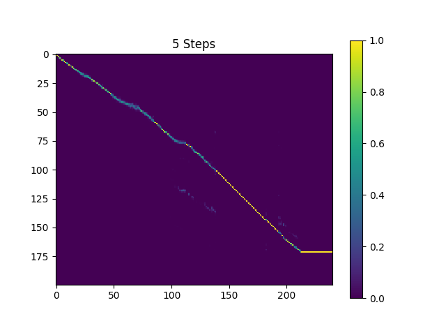

# DC-TTS
The pytorch implementation of papar [Efficiently Trainable Text-to-Speech System Based on Deep Convolutional Networks with Guided Attention](https://arxiv.org/abs/1710.08969).

Thanks for [Kyubyong/dc_tts](https://github.com/Kyubyong/dc_tts), which helped me a lot to overcome some difficulties.

# Dataset
- [The LJ Speech Dataset](https://keithito.com/LJ-Speech-Dataset/). A public domain speech dataset consisting of 13,100 short audio clips of a single female speaker.

# Train
I have tuned hyper parameters and trained a model with The LJ Speech Dataset. The hyper parameters may not be the best and are slightly different with those used in original paper.

To train a model yourself with The LJ Speech Dataset:

1. Download the dataset and extract into a directory, set the directory in `pkg/hyper.py`
2. Run preprocess
    ```
    python3 main.py --action preprocess
    ```
3. Train Text2Mel network, you can change the device to train text2mel in `pkg/hyper.py`
    ```
    python3 main.py --action train --module Text2Mel
    ```
4. Train SSRN network, also, it's possible to change the training device
    ```
    python3 main.py --action train --module SuperRes
    ```

# Samples
Some synthesized samples are contained in directory `synthesis`. The according sentences are listed in `sentences.txt`. The pre-trained model for Text2Mel and SuperRes (auto-saved at `logdir/text2mel/pkg/trained.pkg` and `logdir/superres/pkg/trained.pkg` in training phase) will be loaded when synthesizing.

You can synthesis samples listed in `sentences.txt` with
```
python3 main.py --action synthesis
```

- **Attention Matrix** for the sentence: *"Which came first... the chicken or the egg? Did the universe have a beginning... and if so, what happened before then? Where did the universe come from... and where is it going?"*


# Pre-trained model
The samples in directory `synthesis` is sampled with 410k batches trained Text2Mel and 190k batches trained SuperRes.

The current result is not very satisfying, specificly, some vowels are skipped. Hope someone can find better hyper parameters and train better models. Please tell me if you were able to get a great model.

You can download the current pre-trained model from [my dropbox](https://www.dropbox.com/s/d7r3ol3n1lwvtns/logdir.7z?dl=0).

# Dependancy
- scipy, librosa, num2words
- pytorch >= 0.4.0

# Relative
TensorFlow implementation: [Kyubyong/dc_tts](https://github.com/Kyubyong/dc_tts)

Please [email](chaiyujin@gmail.com) me or open an issue, if you have any question or suggestion.
